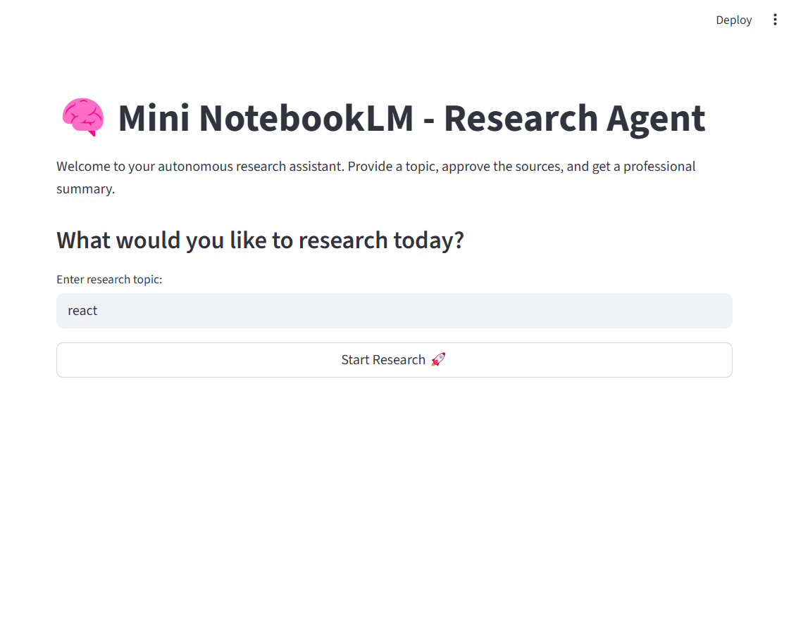
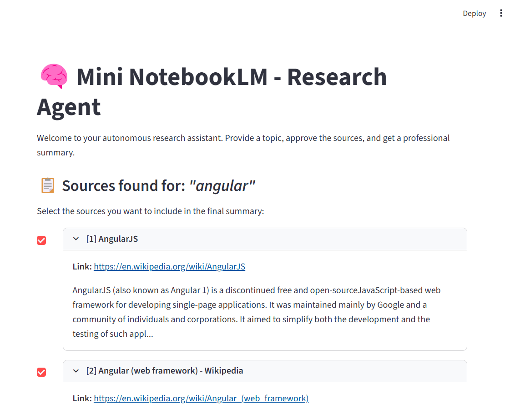
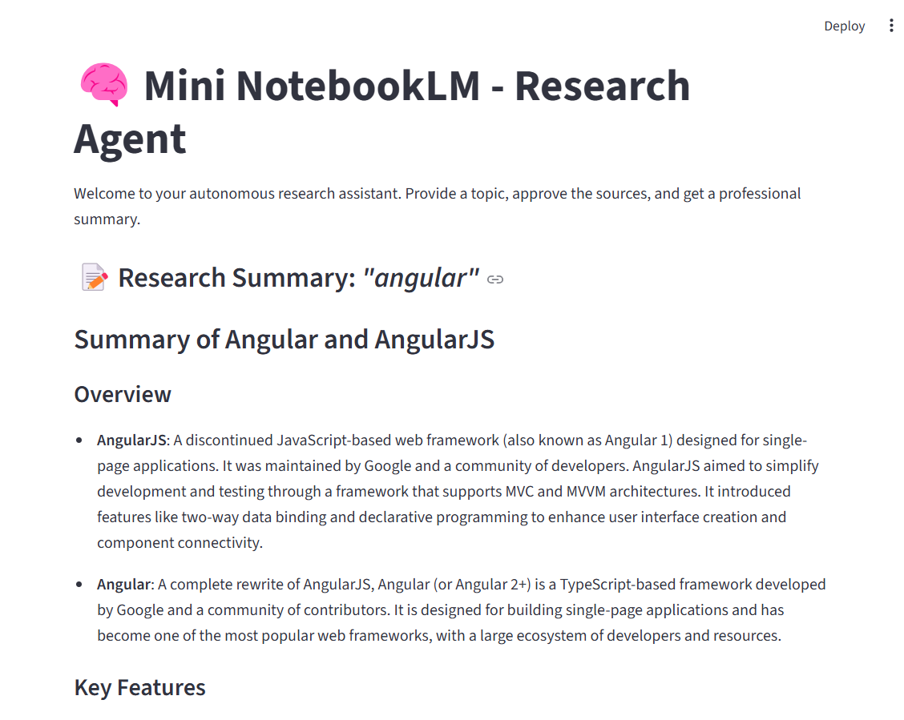

# 🧠 Mini NotebookLM - Autonomous Research Agent

ייצוג אינטראקטיבי ומתקדם של כלי המחקר העוצמתי **NotebookLM** מבית Google. פרויקט זה מתמקד בשלב קריטי של איסוף וסינון מידע חכם מהאינטרנט (Web Research), ומיושם באמצעות סוכני AI מתקדמים.

הפרויקט מבוסס על סוכן אוטונומי המחפש מידע באופן עצמאי ברשת באמצעות **Tavily API**, משתמש במנגנון **Human-in-the-Loop (HITL)** המאפשר למשתמש לאשר או לדחות מקורות מידע בזמן אמת, ומפיק סיכום סופי מדויק מבוסס מקורות מאושרים בלבד בעזרת מודל השפה **GPT-4o-mini**.

---

## 🎯 תכונות מרכזיות (Key Features)

* **Autonomous Search Agent:** סוכן חכם הפועל במודל ReAct לקביעת שאילתות חיפוש אופטימליות.
* **Tavily Search Tooling:** חיבור למנוע חיפוש ייעודי עבור סוכני AI המפיק תוצאות איכותיות וממוקדות.
* **Human-in-the-Loop (HITL):** עצירה מנוהלת של זרימת העבודה (Workflow Breakpoint) לקבלת משוב ואישור המקורות על ידי המשתמש.
* **Session State & Checkpointing:** ניהול זיכרון ומצב שיחה מלא באמצעות `MemorySaver` של LangGraph, המאפשר לשמור את מצב הסוכן ולשחזר אותו לאחר החלטת המשתמש.
* **Rich Streamlit UI:** ממשק משתמש אינטראקטיבי המציג את תהליך החיפוש, כרטיסיות אינטראקטיביות לבחירת מקורות, ותצוגת סיכום מעוצבת בפורמט Markdown כולל אפשרות להורדת התוצר.

---

## 🛠️ טכנולוגיות וכלים (Tech Stack)

* **LangChain & LangGraph:** ניהול ארכיטקטורת הסוכן ומעברי המצבים (StateGraph).
* **OpenAI (GPT-4o-mini):** "המוח" של הסוכן לקבלת החלטות וכתיבת סיכומים.
* **Tavily API:** מנוע חיפוש בזמן אמת המותאם לסוכני AI.
* **Streamlit:** ממשק משתמש מהיר ומעוצב לפייתון.
* **Python-dotenv:** ניהול מאובטח של מפתחות ה-API.

---

## 📸 מראה המערכת (System Walkthrough)

### 1. מסך הזנת נושא המחקר (Input Phase)
המשתמש מגדיר את נושא המחקר ומתניע את הסוכן האוטונומי.


### 2. סינון ואישור מקורות (Human-in-the-Loop Phase)
הסוכן מציג את המקורות שמצא ברשת, והמשתמש בוחר באמצעות תיבות סימון (Checkboxes) אילו מקורות ייכנסו לסיכום הסופי.


### 3. הפקת סיכום מקיף (Summary Phase)
הסוכן מנתח ומסכם אך ורק את המקורות המאושרים ומציג דוח מובנה להורדה.


---

## ⚙️ התקנה והרצה מקומית (Installation & Setup)

בצע את השלבים הבאים כדי להריץ את הפרויקט על המחשב שלך:

### 1. שיבוט הרפוזיטורי (Clone the Repository)
```bash
git clone https://github.com/YOUR_USERNAME/notebooklm-agent-clone.git
cd notebooklm-agent-clone


### 2. יצירת סביבה וירטואלית והפעלתה (Virtual Environment)
```bash
# יצירת הסביבה
python -m venv venv

# הפעלה במערכות Windows (PowerShell):
.\venv\Scripts\Activate.ps1

# הפעלה במערכות Mac/Linux:
source venv/bin/activate
```

### 3. התקנת החבילות (Dependencies)
```bash
pip install -r requirements.txt
```

במידה ואין קובץ requirements.txt, ניתן להתקין ישירות:

```bash
pip install streamlit langchain-core langchain-openai langchain-tavily langgraph python-dotenv
```

### 4. הגדרת מפתחות API (Environment Variables)
צור קובץ בשם `.env` בתיקיית השורש של הפרויקט והזן את המפתחות שלך:

```env
OPENAI_API_KEY=your_openai_api_key_here
TAVILY_API_KEY=your_tavily_api_key_here
```

### 5. הרצת ממשק המשתמש (Run the Application)
```bash
streamlit run app.py
```

האפליקציה תיפתח אוטומטית בדפדפן בכתובת: http://localhost:8501.

---

## 💡 דוגמאות לשאלות ונושאים שהסוכן חוקר בהצלחה (Example Topics)

הסוכן מותאם לחקירת נושאים טכנולוגיים, מדעיים וחדשותיים מורכבים. הנה מספר דוגמאות לנושאים שתוכל להזין למערכת:

* **"React 19 key features and release updates"** - מעולה לבדיקת תכונות קצה חדשות של ספריות קוד פתוח.
* **"Key advancements in Quantum Computing in 2024"** - מחקר מדעי מעמיק המשלב מאמרים אקדמיים ודיווחים מחברות טכנולוגיה.
* **"Artificial Intelligence regulation policies in the EU"** - סקירה חוקתית ומשפטית מבוססת מסמכים רשמיים מרחבי הרשת.
* **"Angular vs React state management patterns in 2024"** - ניתוח השוואתי מקצועי לפיתוח תוכנה.

---

## 👥 רישוי ותרומה לקוד (License)

פרויקט זה נכתב לצרכי למידה תחת קורס AI ו-LangChain. קוד זה חופשי לשימוש ושיפור תחת רישיון MIT.

---

### 🚀 צעד אחרון: העלאת הכול ל-GitHub

כדי שהקובץ וצילומי המסך יעלו בצורה מושלמת, הריצי בטרמינל שלך את הפקודות הבאות:

```bash
# 1. הוספת קובץ ה-README ותיקיית צילומי המסך
git add README.md assets/

# 2. ביצוע קומיט מסודר
git commit -m "docs: add detailed README with screenshots and local setup instructions"

# 3. דחיפה ל-GitHub
git push
```
